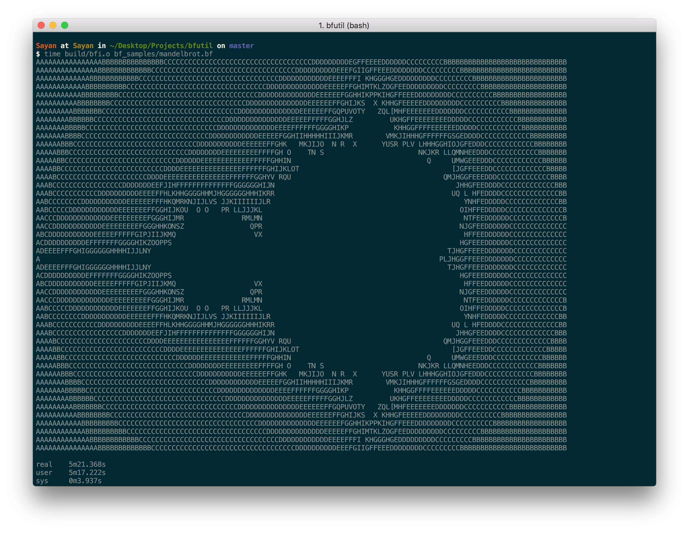

# bfutil
A collection of utilities to make `Brainf**k` great again

- [bf2c](#bf2c) : A wannabe efficient `Brainf**k` to C translator (upto 90x faster than the basic REPL interpreter below)
- [bfinterp](#bfinterp) : An interpreter for `Brainf**k`

## bf2c
A wannabe efficient `Brainf**k` to C translator. Uses code contraction to speed up native `Brainf**k` code execution.

### :octocat: usage

`bf2c <path-to-bf-program> <path-to-store-c-program>`

### :octocat: build

Run `make bf2c` or `make` in the root directory

If you want to rebuild from scratch, run `make clean` and then follow the above instructions

### :octocat: screenshot

## bfinterp
An interpreter for the esoteric language `Brainf**k` written in C++

### :octocat: usage

`bfi [-d] <path-to-bf-program>`

### :octocat: build

Run `make bfi` or `make` in the root directory

If you want to rebuild from scratch, run `make clean` and then follow the above instructions

### :octocat: test

A few sample bf programs are include in the `bf_samples` directory

### :octocat: screenshot

# :octocat: author
Sayan Goswami